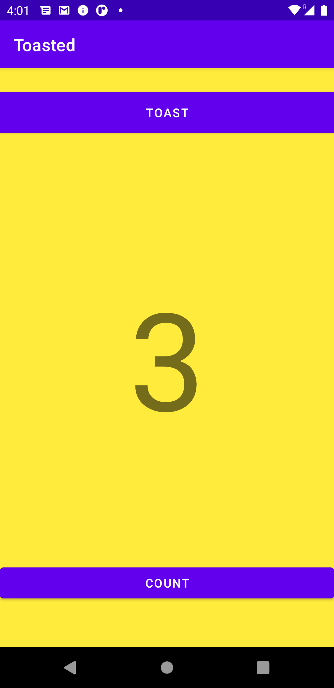
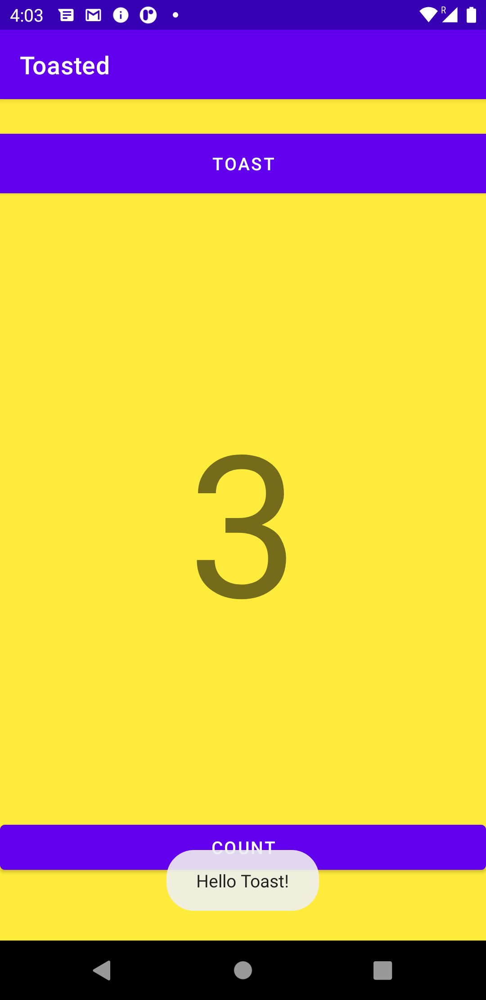
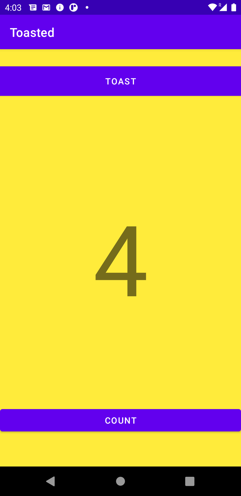

# HelloToast Exercise

HelloToast is the exercise project created to practise on the andriod studio. This project is initiated to show the counter and to show the toast method execution in the application.

## Installation

Clone the project and compile / build the project and you are good to go.

Download the git CLI from the website [git](https://git-scm.com/downloads)

```bash
gh repo clone uniquemozilla22/HelloToast
```

## Running

This is the build screen of the application in which we can see a TextView and two Buttons


 This is the screenshot in which we can see that when we click the toast button on the application the toast is popped up.


This is the screenshot in which we can see that when we click the count button the text view also increments.

## Usage

Clone the Project , Build it and Run it on andriod studio using any api between 24 to latest

## Contributing
Pull requests are welcome. For major changes, please open an issue first to discuss what you would like to change.

Please make sure to update tests as appropriate.

## License
[MIT](https://choosealicense.com/licenses/mit/)
